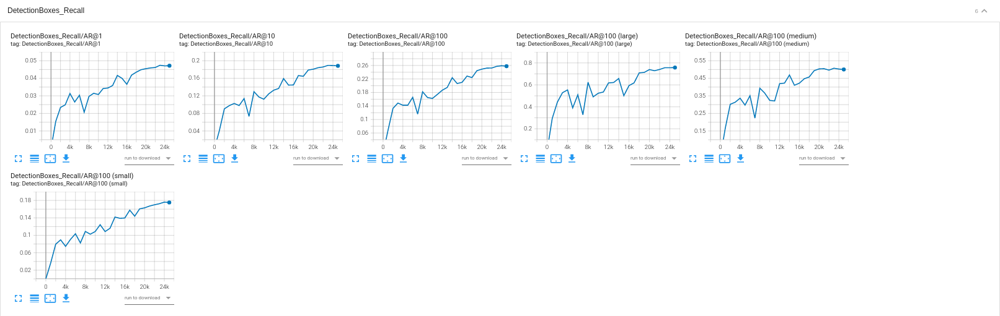
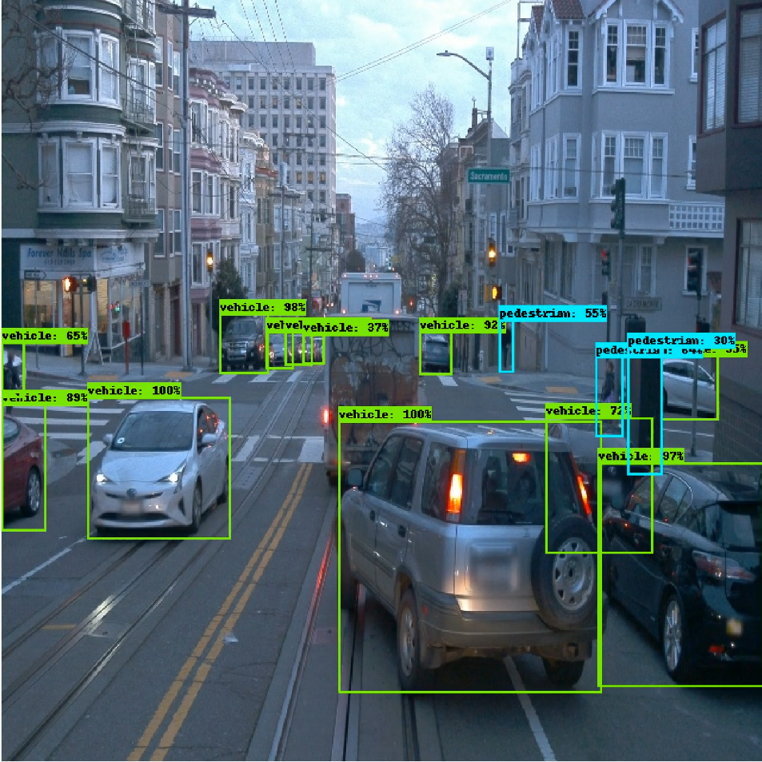
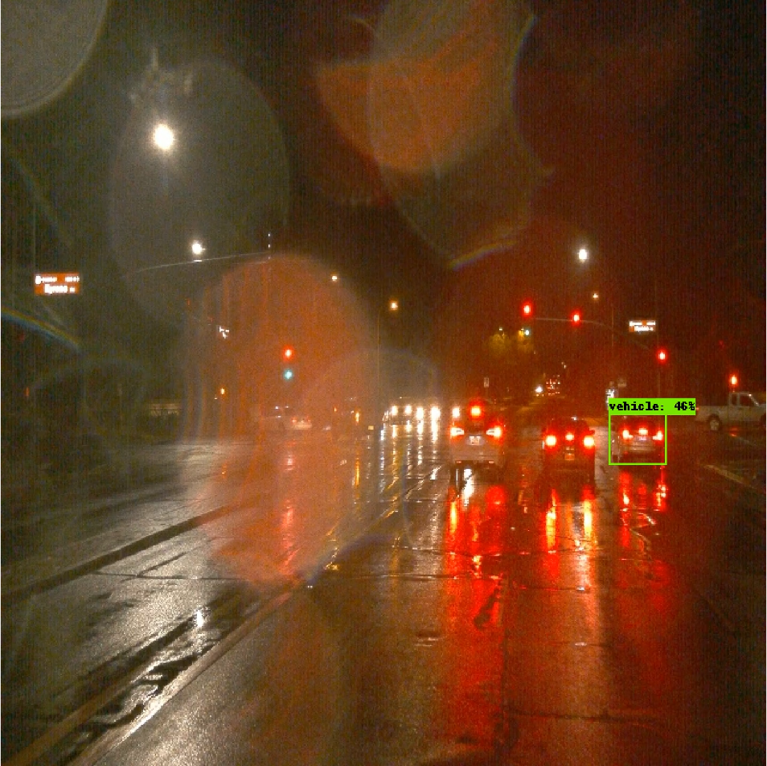

# Object detection in an Urban Environment

## Project overview
- In this project, we train Object Detection models to detect vehicles, pedestrians and cyclists in images extracted from Waymo Open dataset for Perception.
- Object detection is an indispensable module of self-driving car system that provides vital information about the surroundings of the ego vehicle.
- We used pre-trained models of TensorFlow 2 Detection Model Zoo for initializing our models when training.

## Set up
I used local setup using provided [Dockerfile](build/Dockerfile) with below modifications:
1. Install pycotools 2.0.2 (`pip install pycocotools==2.0.2`) to fix `TypeError: 'numpy.float64' object cannot be interpreted as an integer` of pycotools 2.0.0 when evaluating models.
2. Add [update_checkpoints.py](update_checkpoints.py) script to repeatedly update checkpoint file when running evaluation process after training finished. This is a quick-and-dirty script to make evaluation work on my local setup that does not have enough memory to run training and evaluation processes parallelly.
3. Update [model_main_tf2.py](experiments/model_main_tf2.py) file to keep enough checkpoints for evaluation process.
4. Update [inference_video.py](inference_video.py) script to work with tfrecord files that have less than 198 frames. 

## Dataset
### Dataset Analysis
- We have 19803 images in our dataset (100 first tfrecord files in [filenames.txt](filenames.txt)).
- We have 458997 objects in the dataset. They include:
  - 352694 vehicles (76.84%)
  - 103664 pedestrians (22.58%)
  - 2639 cyclists (0.57%)
- Dataset is highly imbalanced. Especially, there are very few labeled cyclists. The model may struggle when detecting cyclists.

- The maximum number of vehicles in each image is 67. Distribution of number of vehicles in each image:

- The maximum number of pedestrians in each image is 44. Distribution of number of pedestrians in each image:

- The maximum number of cyclists in each image is 6. Distribution of number of cyclists in each image:

- The maximum number of labeled objects in each image is 77. Distribution of number of labeled objects in each image:

- There are images with no labeled objects (vehicle, pedestrians, and cyclist)
- Images that have minimum/maximum number of objects in each batch:
  - Image with minimum number of vehicles (0)

  - Image with maximum number of vehicles (67)

  - Image with minimum number of pedestrians (0)

  - Image with maximum number of pedestrians (44)

  - Image with minimum number of cyclists (0)

  - Image with maximum number of cyclists (6)

  - Image with minimum number of labeled objects (0)

  - Image with maximum number of labeled objects (77)

- I directly decoded tfrecord files to iterate the whole dataset. Dataset retrieved by provided `get_dataset` function will yield infinite number of items while iterating the set.
- Please check `Exploratory Data Analysis` notebook for more information.

### Cross validation
Since we have 100 tfrecord files with only around 20k batches and 460k labeled objects in the dataset, I used a split of 60% train, 20% validation and 20% test. I believe that they are appropriate values: 60% batches in the dataset will provide enough data for training while relatively large validation set could help to reduce overfitting.
- 100 processed tfrecord files are shuffled and splitted into train, val and test folders. Please check [create_splits.py](create_splits.py) file for more information.
- Training process will generate model checkpoint every 1000 steps
- Evaluation process will be run when training finished. All save checkpoints will be feeded to evaluation process to check model performance on validation set.

## Training 
### Reference experiment
For reference model (SSD ResNet50 V1 FPN 640x640), I used original pipeline configurations with **batch size 4** (check [training/reference/pipeline_new.config](training/reference/pipeline_new.config) for more information). When training this model, momentum optimizer with cosine decay learning rate was used. Moreover, only horizontal flip and random crop augmentations were applied.

Loss and metrics of the reference experiment:

As shown in above graphs, evaluation metrics increased throughout training steps and did not plateau after 25000 steps. Both training and validation loss also decreased during training. Therefore, increase the number of training steps may improve model performance.

However, the model performs poorly on detection pedestrians and far vehicles in the test set. The model also could not detect some near vehicles in night time. Inference samples with images from test set:

### Improve on the reference
#### Experiment 1
In this experiment, I used default configurations for reference model (SSD ResNet50 V1 FPN 640x640) with **batch size 4** and below modifications (check [training/experiment1/pipeline_new.config](training/experiment1/pipeline_new.config) for more information):
- Use Adam optimizer with cosine decay learning rate
- Add more data augmentations: random adjust hue, contrast, saturation, and brightness.

Loss and metrics of experiment 1:

Unfortunately, evaluation metrics of this model are slightly lower than the reference model. However, this model does perform better in some nighttime scenes maybe due to additional data augmentations. Inference samples with images from test set:

#### Experiment 2
In this experiment, I also used default configurations for reference model (SSD ResNet50 V1 FPN 640x640) with **batch size 6** and below modifications (check [training/experiment2/pipeline_new.config](training/experiment2/pipeline_new.config) for more information):
- Use momentum optimizer with manual step learning rate: 1e-3 for the first 15000 steps, 1e-4 for the next 5000 steps and 1e-5 for remaining steps
- Add more data augmentations: random adjust hue, contrast, saturation, and brightness.

Loss and metrics of experiment 2:

Evaluation metrics of this model are moderately higher than both previous models. Increase batch size could probably enhance model's performance. The downside of this method is that training time is significantly increased.

In the test set, this model also performs better than models in the reference and experiment 1. Inference samples with images from test set:

#### Experiment 3
[Faster R-CNN ResNet152 V1 640x640](http://download.tensorflow.org/models/object_detection/tf2/20200711/faster_rcnn_resnet152_v1_640x640_coco17_tpu-8.tar.gz) model was used. Training was conducted with **batch size 2** due to memory limitation in the local setup. Below modifications were made in the original pipeline configuration file of the model (check [training/experiment3/pipeline_new.config](training/experiment3/pipeline_new.config) for more information):
- Number of classes: 3
- Fine tune checkpoint type: "detection"

Loss and metrics of experiment 3:

Unsurprisingly, evaluation metrics of this model are worse than previous models. It may be because the batch size and number of training steps are quite small for this complex model. Increase these values could probably improve the metrics.

In the test set, this model also does not perform as well as models in the reference, experiment 1 and experiment 2. Inference samples with images from test set:

